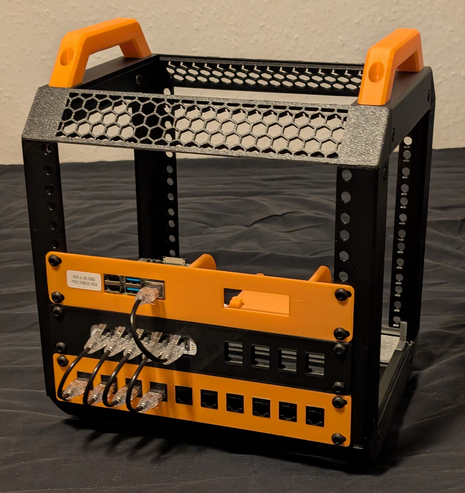
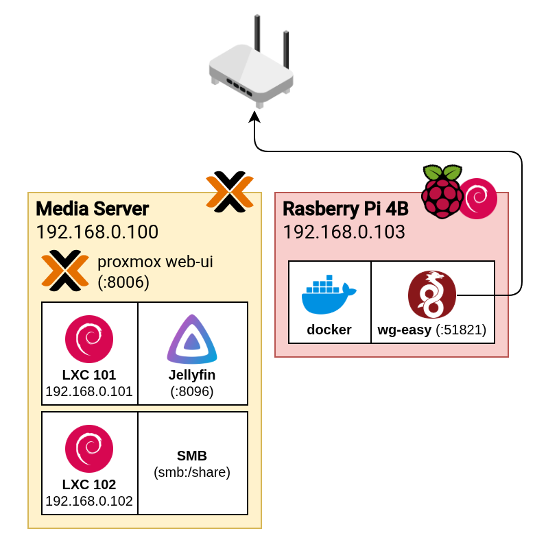

+++
title = "Homelab revamp (LabRax)"
date = 2026-01-12
description = "Getting back into homelabbing with a 3D-printed rack!"
+++

## LabRax 10-inch rack
I have previously had a simple homelab to selfhost applications, both for the convinience selfhosted services can provide,
but also to learn a bit more about networking, containers, etc. The previous iteration had been collecting dust for a while,
but after aquiring a 3D-printer (Creality Ender-3 V3 KE), the dangerous time-and-plastic-hungry combination gave me some newfound motivation to get back into it.

And that is when I stumbled upon the [LabRax](https://makerworld.com/en/collections/5813742-lab-rax) project by *mklements*.

> *"Lab Rax is a fully 3D printable, modular 10-inch server rack for homelabs"* - **mklements**

I have always found rack-hardware cool to look at, but at the same time it seemed so far off from consumer hardware,
both in terms of price and space usage, that I never looked thought to look more into rack setups for a homelab.
However, the 10-inch size makes it way more reasonable to store, and most of the components I will size should all be able to fit within
1U or 2U in the rack.

It took quite a while to print, and I had to use DTU's 3D-printers for the largest parts as they did not fit on my printer, but I am very pleased with the result!



And then for what is actually in this new homelab? It is *very* limited indeed. I currently have a Raspberry Pi 4 (8 GB), a UniFi USW Flex Mini switch
and a patch panel to make the cable management much cleaner (from the front :)). Below is the list of 3D printed mounts and panels I currently have in the rack:

- **1U Unifi UWS Flex Mini mount with keystone:** <br> [https://www.printables.com/model/1210493-10-inch-rack-unifi-usw-flex-mini](https://www.printables.com/model/1210493-10-inch-rack-unifi-usw-flex-mini)
- **1U 2 x Raspberry Pi mount:** <br> [https://www.printables.com/model/1185545-raspberry-pi-2b3b4b5b-10-inch-rack-mount](https://www.printables.com/model/1185545-raspberry-pi-2b3b4b5b-10-inch-rack-mount)
- **1U 10 port keystone patch panel:** <br> [https://www.printables.com/model/1190494-10-inch-keystone-patch-panel-with-label](https://www.printables.com/model/1190494-10-inch-keystone-patch-panel-with-label)

Besides the rack I still have my media server. The reason I stopped using it was because running it 24/7 was overkill in terms of my usage,
and I could turn it off remotely, but not on, meaning it was never on when I wanted it to be. This friction was the reason it was ultimately demoted to the closed...

The new plan is to use the Raspberry Pi as the always-on system, and then remotely turn on the media server on-demond using a Zigbee Smart Plug through HomeAssistant.
This is more of a future plan, but at least the setup allows for this usecase later.

## Software
In the ideal case I would like to use NixOS to manage my servers.
I have (almost) fully switched to NixOS on my personal systems, with the only caveat being still keeping Windows on my desktop for games not supporting Linux.

However I am not quite ready to move entirely over with my servers (yet). There are also some considerations when using NixOS on the Raspberry Pi,
since it has limited computing power for evaluating the config. The idea of having the entirety of my homelab defined declaratively really entices me,
but it is a larger overhaul for a later date.

### Media Server
My media server is running Proxmox. I had to upgrade from an older Proxmox version to the newest current (9.something).
Luckily the [guide to upgrade from 8 to 9](https://pve.proxmox.com/wiki/Upgrade_from_8_to_9) worked seamlessly without any problems.

I am running two LXC containers, one for Jellyfin and one for running a Samba share.
Both of the LXC's are based on the latest debian-template.

The media server has a ZFS pool with two 2TB HDDs in mirror configuration. This pool is used for NAS storage and media content for Jellyfin.

#### Jellyfin LXC
I installed Jellyfin per [the instructions](https://jellyfin.org/docs/general/installation/linux#debian--ubuntu-and-derivatives).
My media server has an iGPU which can be used for transcoding. The iGPU device need to be passed through to the LXC container in order for Jellyfin to access it.
Jellyfin's docs describe [how to passthrough the device](https://jellyfin.org/docs/general/post-install/transcoding/hardware-acceleration/intel/#lxc-and-lxd-container).
After installing Jellyfin and adding the `jellyfin` user to the `render` group, we can passthrough the iGPU from the Proxmox UI.

First, inside the Jellyfin LXC I find Group ID of the `render` group inside the container:

```shell
root@jellyfin:~# cat /etc/group | grep 'render'
render:x:992:jellyfin
```
When can then passthrough the iGPU by adding a *Device Passthrough* under *Resources* of the LXC with the following options:
| **Option**  | **Value**             |
| ----------- | --------------------- |
| Device Path | `/dev/dri/renderD128` |
| GID in CT   | `992`                 |

We can then verify the ownership of the `renderD128` device withing the LXC:
```shell
root@jellyfin:~# ls -al /dev/dri/
total 0
drwxr-xr-x 2 root root         60 Jan 11 13:04 .
drwxr-xr-x 7 root root        500 Jan 11 13:04 ..
crw-rw---- 1 root render 226, 128 Jan 11 13:04 renderD128
```
This have previously caused me some problems with the `renderD128` device getting the Group ID mapped to some other group within the LXC (I am not that experienced with unix permissions...).

With this setup we can access the Jellyfin WebUI and go to *Dashboard > Playback > Transcoding* and enable hardware transcoding using
**Video Acceleration API (VAAPI)** with **VA-API Device** set to `/dev/dri/renderD128`.

#### Samba LXC
For the Samba LXC I just have a simple share to be able to access the files from Windows.
Below is the Samba config I use:
```smb.conf
[global]
   server role = standalone server

[share]
  comment = share
  path = /mnt/data
  browseable = true
  read only = no
  guest ok = no
  valid users = wrang
  create mask = 0664
  directory mask = 0775
```

I am the only one dealing with this share, so I only add a single user with permissions and let this user own the entire share:
```shell
useradd -M wrang            # Add a new user without a home directory
smbpassword wrang           # Give the user a Samba password
chown wrang:wrang /mnt/data # Change the owner of the entire share to the new user
```
The share can then be added using *File Explorer > This PC > Add A Network Location*. Windows 11 is pretty annoying when it comes to network drives that are not online 100% of the time.
I have experience File Explorer still crashing when trying to access a mapped *Network Drive* that is not available. Network Locations seems to be slightly less annoying.

### Raspberry Pi
The Raspberry Pi is running Raspberry Pi OS Lite. All applications on this system will be run using docker (https://docs.docker.com/engine/install/debian/#install-using-the-repository).

Currently I am only running [`wg-easy`](https://github.com/wg-easy/wg-easy), which runs a Wireguard VPN server and exposes a WebUI to manage user configurations. I am planning on running HomeAssistant, and have purchased a [Sonoff Zigbee 3.0 USB dongle](https://www.amazon.de/ZBDongle-EFR32MG21-Coordinator-Assistant-Zigbee2MQTT/dp/B0B6P22YJC/) which I plan on passing through to a HomeAssistant container.

## Conclusion
I am very happy with with the result. It is much easier to work with the network gear mounted like this instead of devices lying in a giant budle (and very much a fire-hazard...). 
There is still much to do but this is a great starting point for adding some more services and starting on the HomeAssistant rabbit hole.


