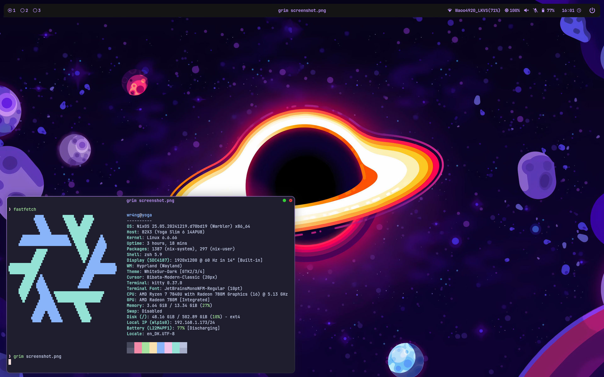

+++
title = "The NixOS rabbit hole"
date = 2024-12-30
description = "What happens when you have a little too much time in your vacation and stumbles upon NixOS..."
+++

What happens when you stumble upon NixOS at when you have a little too much available time on your hands? **This** happens.

## Preface

I've been using Arch Linux (*btw*) for this semester on my laptop and have been really happy with my setup. I've been able to solve most of my issues using either the [ArchWiki](https://wiki.archlinux.org/title/Main_page) and the AUR, only having to login Gnome with X11 instead of Hyprland for select applications (I'm looking at you `jspin` 👀).

**But**, this works best when I only use my personal laptop. Introducing my home desktop PC, which is mostly used for gaming, the setup isn't quite as nice. I'd gotten into a good workflow where (most) of my configuration files are stored in my [dotfiles repo](https://github.com/wr4ng/dotfiles), which are then symlinked to their appropriate location using `stow`. This made it pretty easy to update my `neovim` configuration, commit my changes and then pull them down whenever I got home.

However NixOS takes configuring my system(s) to the next level. Before I dive in, here are some of the amazing resources that inspired me to jump into the rabbit hole, and helped guide my NixOS config in the (hopefully) right direction:

- [No Boilerplate: *NixOS: Everything Everywhere All At Once* (YouTube)](https://www.youtube.com/watch?v=CwfKlX3rA6E)
- [Vimjoyer: *Ultimate NixOS Guide | Flakes | Home-manager* (YouTube)](https://www.youtube.com/watch?v=a67Sv4Mbxmc)  
(Generally the entirety of Vimjoyer's NixOS playlist)
- [The NixOS Wiki](https://wiki.nixos.org/wiki/NixOS_Wiki)
- And a *lot* of ChatGPT/Ollama conversations...  
(ChatGPT seemed to be a little outdated, so not a good resource for getting specific names, but can help with Nix syntax)

## The Beginning 
I started by downloading the latest nixos `.iso`, adding it to my [ventoy](https://www.ventoy.net/) drive and installed it on some leftover space on my desktop PC's drive. I began using Gnome (included in the image I selected) and wanted to setup Nvidia drivers for my RTX 3080. I used the [NixOS Wiki Nvidia entry](https://nixos.wiki/wiki/Nvidia), added the configuration to my `/etc/nixos/configuration.nix`, rebuilt my config and bam. Drivers were ready.

This was pretty much the workflow on getting stuff working:
1. Need to get `x` working
2. Search for `x` in the NixOS Wiki or in [nixpkgs](https://search.nixos.org/packages)
3. Add configuration found to `etc/nixos/configuration.nix`  
(i.e. add `neovim` to `environment.SystemPackages` set)
4. Try to rebuild: `nixos-rebuild switch`  
    a. Success! `x` is now working!  
    b. Build failed... try to figure out why...

And to be honest, I ran into *4.b.* a lot. The `nix` language used to configure NixOS is very powerful, but It does have a bit of af learning curve. Being used to `.yaml`, `.json`, `.toml`, etc. ([xkcd/927](https://xkcd.com/927/)) as configuration formats, using a full-blown programming language takes a lot longer to get used to, I'm not quite there yet. However it lets you do some pretty cool stuff (see later), and I quite like the idea of thinking of my configuration as a codebase instead of as individual config files.

## The Great Refactoring

<p style="color: red;">TODO: Refactoring into flakes + modules. Getting to know the nix language. Use example module.</p>

## The Result

{.rounded-corners .drop-shadow}

One of the things I like most about NixOS is that I know that any problem I encounter and solve is *declaratively* solved. Meaning, using the same config, I should never run into that problem again. With my previous arch setup, there were times where I would run into a problem, google-fu my way to a solution requiring editing `etc/.../some-file` and/or running `some-command --xyz` and the problem is solved. However, when I run into the problem again in the case of my home PC or setting up a new device, I probably didn't document how I solved it and have to find the solution again. I can probably find the solution faster the second time around, however my experience is that the number of these small tweaks piles up, and I don't want to have to document all of them to be sure I can get back to the same setup.

Using NixOS it's almost as if solving the problem and documenting it is one and the same. In Nix, it would look like:
```nix
# Setup some-program to do something
some-program = {
    some-option = some-value;
    some-other-option = some-other-value;
};
...
```

## Conclusion
