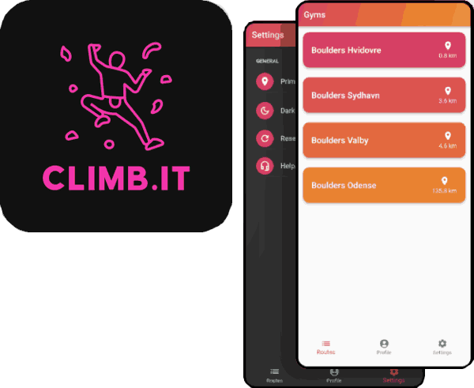

+++
title = "climb.it"
date = 2023-06-20
description = "Climbing/bouldering companion app using Flutter and Firebase."
technologies = ["Flutter", "Firebase"]
github = "https://github.com/Skysub/climb.it"
+++

Android and iOS app built using Flutter with a Firebase backend (Realtime Database).
A climbing/bouldering companion prototype, allowing users to view available climbing routes
at their local gym, mark completed routes and get an overview of the difficulty of completed routes.

Routes can be filtered using both difficulty (using the V-system) and by tags like *"slab"* or *"overhang"*.

