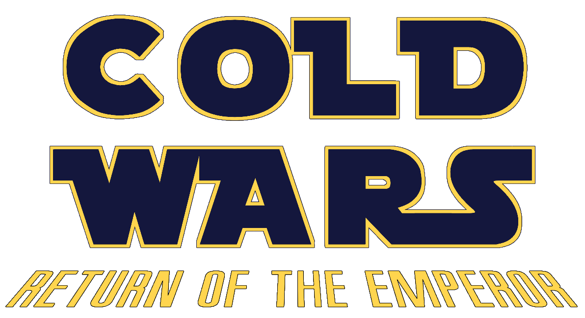
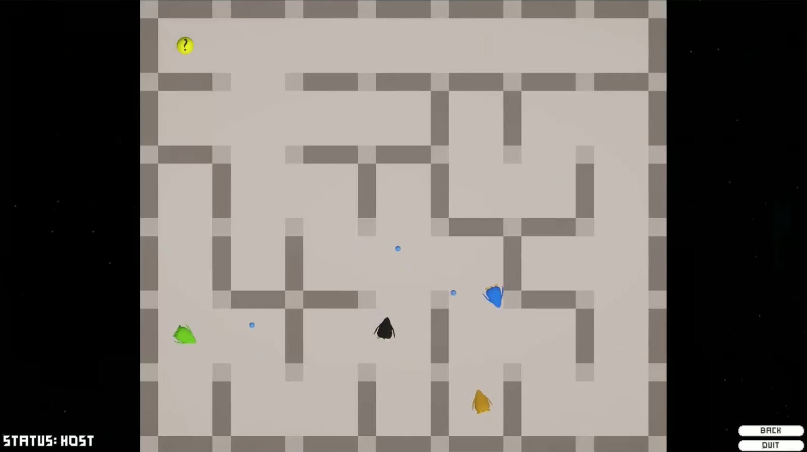

+++
title = "Cold Wars: Return of the Emperor"
date = 2025-01-23
description = "A Unity multiplayer game using tuple-spaces for communication"
technologies = ["Unity", "C#"]
github = "https://github.com/wr4ng/cold-wars-return-of-the-emperor"
+++

A multiplayer game built for the DTU (Technical University of Denmark) course
**02148 Introduction to Coordination in Distributed Applications** ([course info](https://kurser.dtu.dk/course/02148))
during a period of 3 weeks in a group of 5 students. The game is built using Unity and C#.

The design of the game is based on a crossover between **Club Penguin** and **Star Wars**, and the gameplay
is heavily inspired by Tank Trouble. One player can host a game, and other players can join by entering the IP-address of the host.
Player are placed randomly in a randomly generated maze, and can move around and shoot each other. Once only one penguin remain,
a new maze is generated and everyone respawns.

{.rounded-corners .drop-shadow}

The game utilizes [tuple spaces](https://en.wikipedia.org/wiki/Tuple_space) to communicate between
the host and clients. Messages use tuples of the form `(string, byte[])` where the first element denote
the message's type, and the second the parameters passed along with the message. This allowed us
to send arbitrary parameters and still use type-matching to fetch tuples from the tuple-spaces.

**Demo:** https://www.youtube.com/watch?v=KURd3KKwY5s
